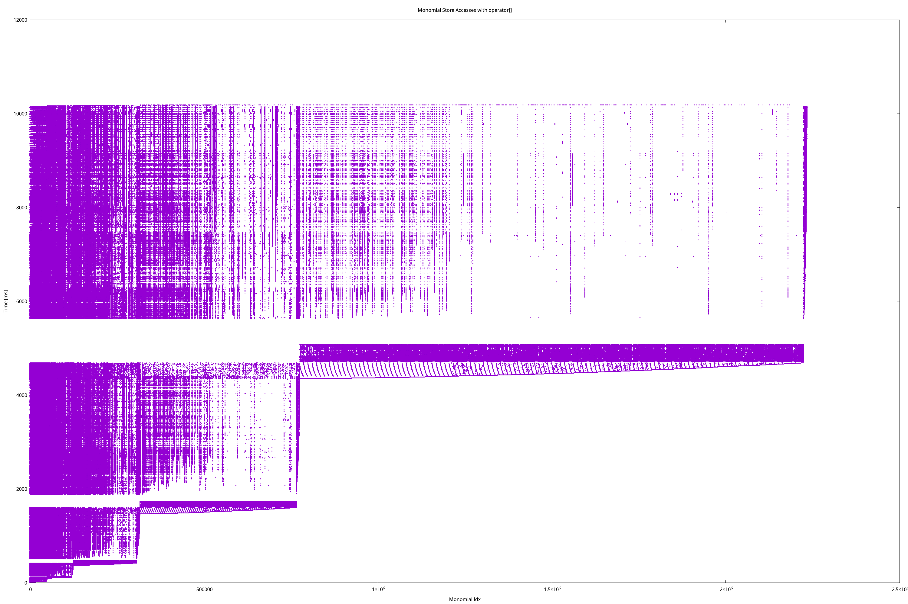
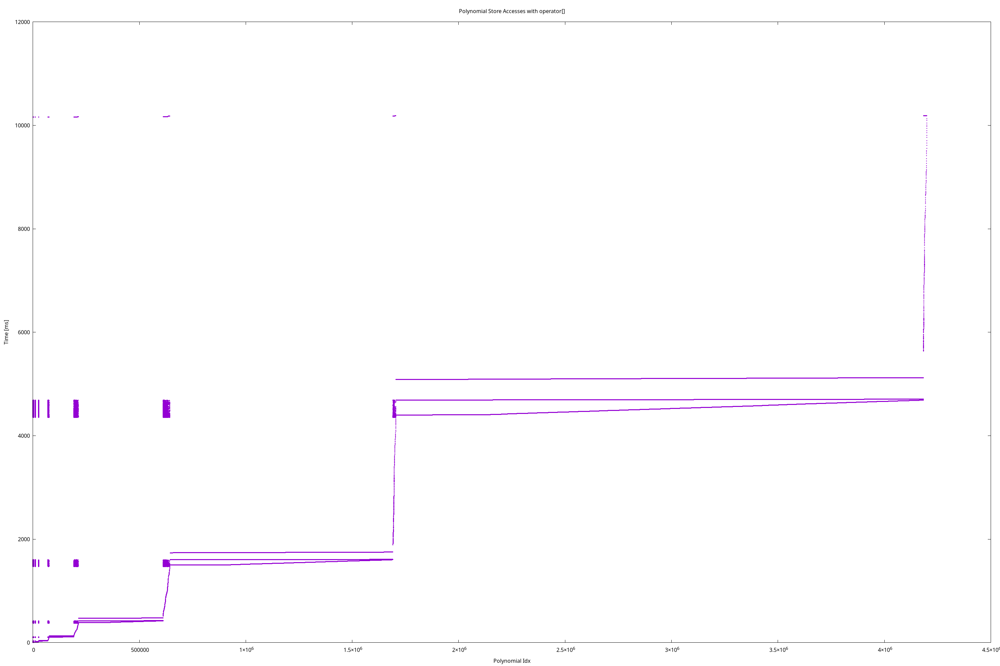

# f4ncgb

`f4ncgb` is an open-source C++ library for computing noncommutative Gröbner bases
in free algebras (with rational coefficients or coefficients in a prime field). 
It transfers recent advancements in commutative Gröbner basis software to the
noncommutative setting.

Below is a runtime comparison (in seconds) of `f4ncgb` with the state-of-the-art implemenation in [Singular](https://www.singular.uni-kl.de/index.php.html).
The selected benchmarks are part of the [SymbolicData project](https://symbolicdata.github.io).

| Example&nbsp;&nbsp;&nbsp;&nbsp;&nbsp;&nbsp;&nbsp;&nbsp;&nbsp;&nbsp;&nbsp;&nbsp;&nbsp;&nbsp;&nbsp;&nbsp; | Singular&nbsp;&nbsp;&nbsp; | f4ncgb&nbsp;&nbsp;&nbsp;&nbsp;&nbsp;&nbsp; (1 core) |  f4ncgb&nbsp;&nbsp;&nbsp;&nbsp;&nbsp;&nbsp;&nbsp;&nbsp; (2 cores) |  f4ncgb&nbsp;&nbsp;&nbsp;&nbsp;&nbsp;&nbsp; (4 cores) |  f4ncgb&nbsp;&nbsp;&nbsp;&nbsp; (8 cores) | 
| --------- | ------ |-----|------- | ------ |-----|
| 4nilp5s-10 |  1 282.44 | 150.46 | 96.83 | 79.47  | 65.96  |
| braid3-16  | 18 953.19  | 105.46 |  64.92  |    34.58     |   23.96   |
| braidX-18  | >43 200 | 1 977.27 | 1 018.47 |  601.12  | 364.29 |
| braidXY-12 | 1 847.97 | 62.40  | 55.45 | 52.44 | 53.51  |
| holt_G3562h-17  | >43 200 | 25 021.62 | 14 660.04 | 12 671.38 | 8915.69 |
| lascala_neuh-13  | 171.95 | 9.84 | 7.08 | 5.50 | 4.98 |
| lv2d10-100  | >43 200 | 48.43 | 34.31 | 27.68 | 26.98 |
| malle_G12h-100  | 4 142.27 | 89.93 | 78.04 | 74.15 | 74.19 | 
|  serre-e6-17 | 113.95 | 130.62 | 130.07 | 130.53 | 131.01 |
| serre-ha11-17 | 99.09 | 38.18 | 32.79 | 31.66 | 30.77 |

# Table of Contents

[[_TOC_]]

# Compilation

## Dependencies

Please install the following required dependencies:

-   [Boost](https://www.boost.org/) (tested with 1.83, at least 1.80, Apt Package `libboost-all-dev`)
-   [Flint](https://flintlib.org/) (tested with 3.0.1, Apt Package `libflint-dev`)
-   [GMP](https://gmplib.org/) (tested with 6.3.0, Apt Package `libgmp-dev`)

And recommended:

-   [Mimalloc](https://github.com/microsoft/mimalloc) (for more efficient memory allocation, tested with 2.1.2,
    Apt Package `libmimalloc-dev`)

The fuzzer can be used by cloning [FuzzTest](https://github.com/google/fuzztest) into the project's root
directory.

## Compilation using CMake

Please use [CMake](https://cmake.org/) to compile this project. All dependencies are
automatically found:

    git clone https://gitlab.sai.jku.at/f4ncgb/f4ncgb.git
    mkdir build-release
    cd build-release
    cmake .. -DCMAKE_BUILD_TYPE=Release
    make -j

Then, `f4ncgb`, `f4ncgb_test`, and `mod_prime_tester` are produced.

The release build automatically optimizes using `-march=native`, so
the resulting binary may not run on a machine that does not support
the same instructions as the builder.

# Basic usage of `f4ncgb`

    ./f4ncgb <input.ms>

These are the provided options (also visible from `--help`:

-   **`--version`:** Produce version message
-   **`--help`:** Produce help message
-   **`--expanded-proof`, `-e`:** Whether the proofs should be expanded
    and written in terms of the input. Requires proof logging to be
    turned on
-   **`--input`, `-i`:** Set the input file (either msolve, poly, or
    sympoly)
-   **`--maxiter`, `-m`:** Maximal number of iterations of the
    F4-algorithm to be performed (default: 10)
-   **`--maxdeg`, `-d`:** Maximal degree of ambiguities that are
    considered (default: INTMAX)
-   **`--output`, `-o`:** Set the output file
-   **`--print-problem`:** Re-print the problem after parsing.
-   **`--proof`, `-p`:** Proof logging
-   **`--threads`, `-T`:** Number of threads to be used
-   **`--tracer`, `-t`:** Whether computations with the first prime
    shall be traced. Speeds up the computation, but yields the correct
    result only with high probability
-   **`--verbosity`, `-v`:** Set the verbosity level

## `msolve` Input Format

This format is compatible to the input format of [msolve](https://msolve.lip6.fr/). We provide
a simplified EBNF below.

    input          := var_list EOL
                      characteristic EOL
                      poly_list EOF .
    
    var_list       := ident { "," ident } .
    
    characteristic := int .
    
    poly_list      := poly { "," EOL poly } .
    
    poly           := ["+","-"] [ factor ] mon { ["+","-"] factor mon } .
    
    mon            := ident [ exp ] { "*" ident [ exp ] } .
    
    factor         := int [ "/" int ] .
    
    exp            := "^" int .
    
    ident          := letter { letter | digit } .
    
    int            := digit { digit } .
    
    letter         := "A"..."Z" | "a"..."z" | ... .
    
    digit          := "0"..."9" .

## `poly` Input Format

Poly is a simplified format made for machine generation, inspired by the 
DIMACS format that SAT-solvers use. We provide a simplified EBNF below.

    input          := "p poly " nr_of_vars nr_of_blocks characteristic EOL
                      block { EOL block } EOL
                      poly { EOL poly } EOF .
    
    nr_of_vars     := nat .
    
    nr_of_blocks   := nat .
    
    characteristic := nat .
    
    block          := nat { nat } "0" .
    
    poly           := mon { "+" mon } 0 .
    
    mon            := numerator denominator var { var } .
    
    numerator      := int .
    
    denominator    := nat .
    
    var            := nat .
    
    int            := ["+","-"] nat .
    
    nat            := digit { digit } .
    
    digit          := "0"..."9" .

## `symboly` Input Format

This is the same as the `poly` format, but a `var` can be a symbol
(ident).

# Tests

    ./f4ncgb_test

This should produce the following output:

    Running 12 test cases...
     
    *** No errors detected

Internally, the tests also create our store structure multiple times
and test the memory allocation to fit our requirements.

# Additional features

## Optimization for Mersenne Primes

We provide a specialized implementation for computing modular images modulo Mersenne primes.
To evaluate this implemenation against the standard `%`-operator, we provide the `mod_prime_tester` executable.

Run the exhaustive tests:

    ./mod_prime_tester -t

The tests output three columns: `test`, the highest number tested (up
to the given prime number), and the time (in seconds). Each
calculation is checked against the standard modulo operation. Below is
an example output using GCC 15.1 on Fedora 42 on an Intel i7-10700
CPU.

    test			2147483647	0.924757

Run the benchmarks:

    ./mod_prime_tester -b

The benchmark output three rows: The variant (the standard modulo, the
optimized variant using the mersenne prime `2^31-1`, and a modulo
power-of-two variant as "upper limit" of our Mersenne-optimization, as
the compiler can optimize a modulo power-of-two into a bitmask). The
columns are (as in the test) the highest number tested, the time (in
seconds) for each run, and (for the optimized variant), the speedup
compared to the standard modulo. Below is an example output using GCC
15.1 on Fedora 42 on an Intel i7-10700 CPU.

    benchmark-standard	2147483647	3.685986
    benchmark-optimized	2147483647	0.461233	7.991587
    benchmark-power-of-two	2147483647	0.464492

Some examples of the Mersenne Prime optimization speedups with
different compilers and processors, each tuned to the native
instruction set level using `-march=native` can be seen in the table
below. We sorted the table according to the achieved speedup. While
the optimized variant is slower for Clang, GCC produces binaries that
overall are faster than the ones from Clang.

<table border="2" cellspacing="0" cellpadding="6" rules="groups" frame="hsides">

<colgroup>
<col  class="org-left" />

<col  class="org-left" />

<col  class="org-right" />

<col  class="org-right" />

<col  class="org-right" />
</colgroup>
<thead>
<tr>
<th scope="col" class="org-left">CPU</th>
<th scope="col" class="org-left">Compiler</th>
<th scope="col" class="org-right">Standard [s]</th>
<th scope="col" class="org-right">Optimized [s]</th>
<th scope="col" class="org-right">Speedup [Standard/Optimized]</th>
</tr>
</thead>
<tbody>
<tr>
<td class="org-left">Intel i7-10700</td>
<td class="org-left">GCC 15.1.1 20250425 (Red Hat 15.1.1-1)</td>
<td class="org-right">11.685667</td>
<td class="org-right">1.311982</td>
<td class="org-right">8.9068806</td>
</tr>

<tr>
<td class="org-left">Intel Xeon w5-2455X</td>
<td class="org-left">GCC Ubuntu 13.3.0</td>
<td class="org-right">4.709925</td>
<td class="org-right">1.177109</td>
<td class="org-right">4.0012650</td>
</tr>

<tr>
<td class="org-left">AMD EPYC 7443P</td>
<td class="org-left">GCC Ubuntu 13.3.0</td>
<td class="org-right">3.757219</td>
<td class="org-right">1.072234</td>
<td class="org-right">3.5041036</td>
</tr>

<tr>
<td class="org-left">AMD EPYC 7443P</td>
<td class="org-left">Clang 18.1.3 (1ubuntu1)</td>
<td class="org-right">3.754652</td>
<td class="org-right">1.072636</td>
<td class="org-right">3.5003972</td>
</tr>

<tr>
<td class="org-left">AMD EPYC 7313</td>
<td class="org-left">Clang 18.1.3 (1ubuntu1)</td>
<td class="org-right">4.057575</td>
<td class="org-right">1.159551</td>
<td class="org-right">3.4992639</td>
</tr>

<tr>
<td class="org-left">AMD EPYC 7313</td>
<td class="org-left">GCC Ubuntu 13.3.0</td>
<td class="org-right">4.057734</td>
<td class="org-right">1.159754</td>
<td class="org-right">3.4987885</td>
</tr>

<tr>
<td class="org-left">Intel i7-10700</td>
<td class="org-left">Clang 20.1.3 (Fedora 20.1.3-1.fc42)</td>
<td class="org-right">11.623475</td>
<td class="org-right">8.451767</td>
<td class="org-right">1.3752716</td>
</tr>

<tr>
<td class="org-left">Intel Xeon w5-2455X</td>
<td class="org-left">Clang 18.1.3 (1ubuntu1)</td>
<td class="org-right">4.708247</td>
<td class="org-right">3.460993</td>
<td class="org-right">1.3603746</td>
</tr>

<tr>
<td class="org-left">MacBookAir M2 (ARM64)</td>
<td class="org-left">AppleClang 16</td>
<td class="org-right">1.263310</td>
<td class="org-right">1.491293</td>
<td class="org-right">0.84712394</td>
</tr>
</tbody>
</table>

## Store Access Patterns

The store supports writing traces of when which index is accessed
through `operator[]`. This accurately represents what areas in which
store is being used over time. Below are some renderings of these
access patterns for smaller input files.

In order to create these images, add the CMake parameter
`-DENABLE_STORE_TRACE=ON`. Then, the resulting store creates two
archives: `<input>_monomial_store.zst` and
`<input>_polynomial_store.zst`. These can be turned into two PNGs
using Gnuplot by adding the `<input>` file as parameter, using our
provided script: `gnuplot -e "name='<input>'"
scripts/index_map.gnuplot`. Gnuplot may require very large amounts of
RAM for this step, as it renders each access individually as a point.

Creating the access patterns requires [Gnuplot](http://www.gnuplot.info/).

Here are examples of the access patterns for the input
 `test_inputs/braid3.ms` with default options of `f4ncgb`

### Monomial Store Accesses

### Polynomial Store Accesses

# Citing `f4ncgb`

If you have used `f4ncgb` for a paper, we would kindly ask you to cite it as:

    f4ncgb: High Performance Gröbner Basis Computations in Free Algebras.
    Maximilian Heisinger and Clemens Hofstadler.
    arXiv preprint arXiv:2505.19304, 2021.

Or, if you are using BibTeX:

    @misc{f4ncgb,
          title={{f4ncgb: High Performance Gr\"obner Basis Computations in Free Algebras}}, 
          author={Maximilian Heisinger and Clemens Hofstadler},
          year={2025},
          eprint={2505.19304},
          archivePrefix={arXiv},
          primaryClass={cs.MS},
          url={https://arxiv.org/abs/2505.19304}, 
    }

The paper can be found [here](https://arxiv.org/abs/2505.19304).

